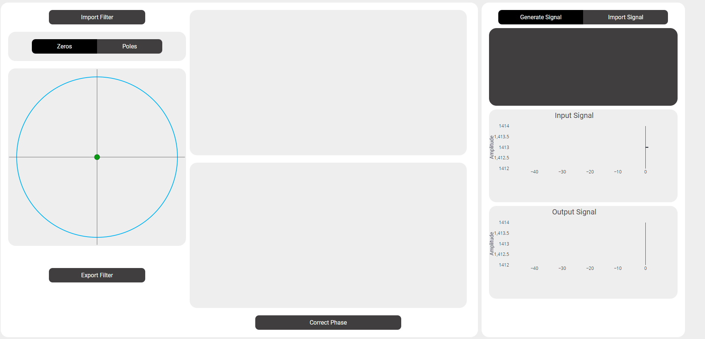
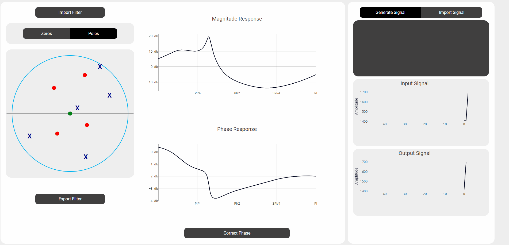
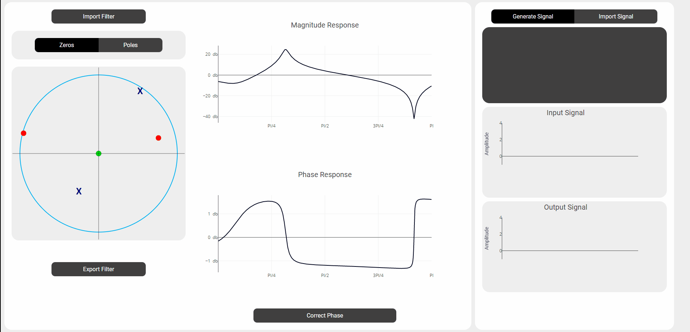
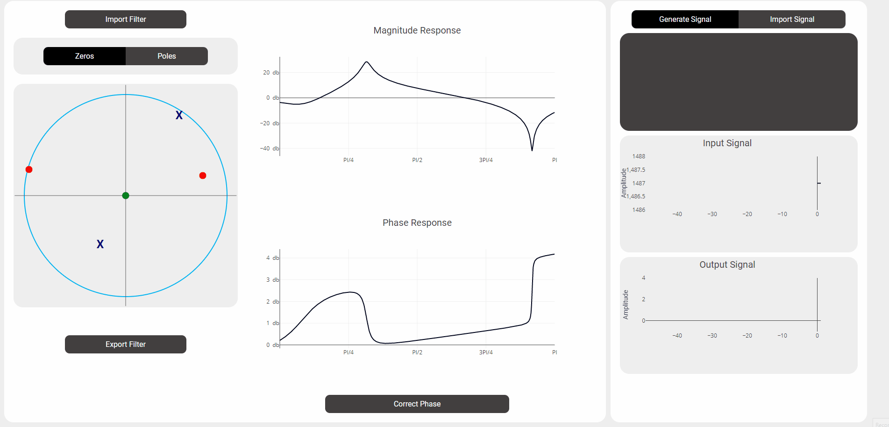
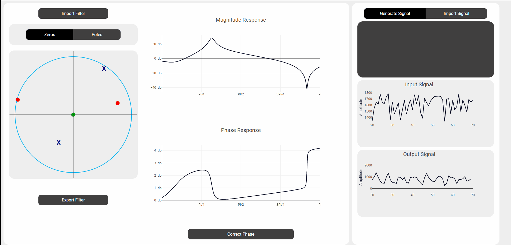

# Digital Filter Designer || DSP Task 5

## Table of contents:

- [Introduction](#introduction)
- [Project Features](#project-features)
- [Project Structure](#project-structure)
- [How to Run The Project](#run-the-project)
- [Team]()

### Introduction

Digital Filter Designer web application provides users with full functionality to design filters using drag and drop for zeros/poles, and filter phase correction.

In this web application you can

> 1. Put unlimited zeros and poles with real time filter response
>    

> 2. Drag /Delete convert zero to pole and vice versa easily
>    

> 3. Import/Export Filters
>    

> 4. Upload signal to filter real-time or Generate random signal to test your filter
>    

> 5. Correct Phase with allpass filter with 2 options, choose from catalog provided or put your a value to generate yours.
>    

### Project Structure

The Web Application is built using:

- Frontend:
  - HTML
  - CSS
  - JavaScript
  - Ajax
- Backend framework:

  - Flask (Python)

- The Frontend responsibility is:

  - Plotting, drag and drop zeros and poles. (main.js)
  - Graphs Plotting for signals (signals-generation.js)
  - Send Zeros/poles poistions realtive to unit circle (filter-section.js)

- While Backend main function to
  - Create filters given zeros/poles
  - Filter Signals

```
main
├─ Processing
│  ├─  processing.py
│  └─  filter.py
├─ static (JS & CSS files)
│  ├─  Catalog(allpass catalog)
|  ├─  css
│  ├─  img
│  └─  js
│      ├─  main.js
│      ├─  correct-phase.js
│      ├─  filter-section.js
│      ├─  signal-generation.js
│      └─  signals-section.js
├─ template (HTML files)
├─ app.py (Back-End Server)
├─ example.json (filter example)
└─ README.md
```

### Run the Project

1. Install [Python3](www.python.org/downloads/) in your computer

2. Install the packages

- Open Project Terminal & Run

```
pip install -r requirments.txt
```

3. Start Server by Running

```
python app.py
```

4. Visit http://127.0.0.1:5000

### Team

First Semester - Biomedical Digital Signal Processing (SBE3110) class project created by:

| Team Members' Names                                    | Section | B.N. |
| ------------------------------------------------------ | :-----: | :--: |
| [Abdelrahman Yasser](https://github.com/Abdelrhman012) |    1    |  52  |
| [Kamel Mohammed](https://github.com/KamelMoohamed)     |    2    |  10  |
| [Romaisaa Shrief](https://github.com/Romaisaa)         |    1    |  36  |
| [Youssef Shaaban](https://github.com/youssef-shaban)   |    2    |  56  |

### Submitted to:

- Dr. Tamer Basha & Eng. Abdullah Darwish
  All rights reserved © 2022 to Team 4 - Systems & Biomedical Engineering, Cairo University (Class 2024)
